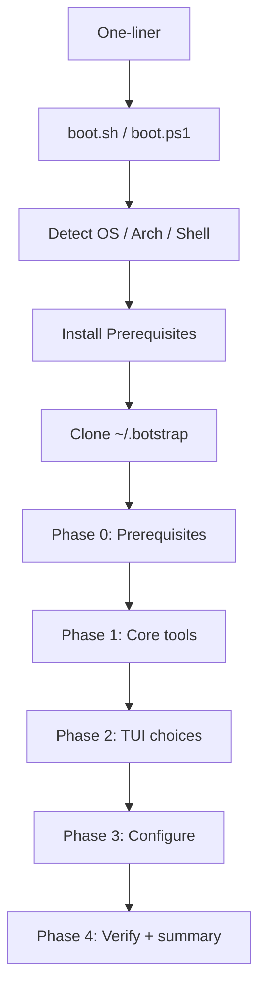

# Botstrap architecture

Botstrap is a cross-platform, one-command bootstrap that turns a fresh Mac, Linux, or Windows machine into a configured developer environment with an AI-agent-friendly layout. This document describes how the system is structured and how components interact.

## Goals

- **One command** on each platform that runs the same logical flow.
- **Registry-driven** tool definitions (YAML) instead of hardcoded install lists in orchestration code.
- **Phased install**: prerequisites, non-interactive core, interactive TUI, configuration, verification.
- **AI-first defaults**: predictable PATH, non-interactive CLIs, structured agent scaffolding.

## Entry points and boot sequence

Three surfaces resolve to the same flow:

| Platform | One-liner |
|----------|-----------|
| macOS / Linux | `curl -fsSL https://botstrap.org/install \| bash` |
| Windows | `irm https://botstrap.org/install.ps1 \| iex` |

The server at `botstrap.org/install` may serve the correct script from `User-Agent` or expose explicit `.sh` / `.ps1` URLs.

**Boot sequence**

1. Download and run `boot.sh` or `boot.ps1`.
2. Detect OS, architecture, and shell (`lib/detect.sh` / `lib/detect.ps1`).
3. Ensure `git` is available (install if missing).
4. Clone this repository to `~/.botstrap` (or `%USERPROFILE%\.botstrap` on Windows).
5. Hand off to `install.sh` or `install.ps1`.

Environment overrides for development or mirrors:

- `BOTSTRAP_HOME` — install location (default `~/.botstrap`).
- `BOTSTRAP_REPO` — Git remote URL used when cloning.

## Repository layout

```
botstrap/
  boot.sh / boot.ps1          # curl / irm entry
  install.sh / install.ps1    # Orchestrators
  lib/                        # Shared primitives (detect, log, pkg)
  install/                    # Phases and per-tool modules
  configs/                    # Templates for shell, git, editor, agent
  themes/                     # Theme bundles (terminal, prompt, editor)
  registry/                   # core.yaml, optional.yaml
  docs/                       # Design and contributor docs
  version                     # Semver for migrations and reporting
```

See `docs/REGISTRY_SPEC.md` for the registry schema and `docs/CROSS_PLATFORM.md` for package-manager mapping.

## Installation phases



| Phase | Script | Purpose |
|-------|--------|---------|
| 0 | `phase-0-prerequisites.sh` / `.ps1` | `git`, `curl`, `gum` (and Windows equivalents) so later steps can run. |
| 1 | `phase-1-core.sh` | Non-interactive install of all `registry/core.yaml` tools via `lib/pkg` + registry. |
| 2 | `phase-2-tui.sh` | Interactive `gum` flows; choices exported as environment variables. |
| 3 | `phase-3-configure.sh` | Dotfiles, themes, editor and agent templates from `configs/`. |
| 4 | `phase-4-verify.sh` | Run `verify` commands from the registry; print summary and next steps. |

Optional per-tool scripts under `install/modules/` hold logic that is too complex for inline YAML (extra guards, post-steps). Simple tools can be YAML-only.

## Registry-driven package layer

`lib/pkg.sh` (and `lib/pkg.ps1` on Windows) provide:

- **`pkg_install <tool>`** — resolve the tool in `registry/core.yaml` (or a selected optional item), pick the install snippet for the current OS/distro, and execute it.
- **`pkg_verify <tool>`** — run the tool’s `verify` command from the registry.

Orchestrators should prefer the registry as the source of truth; modules supplement where needed.

## TUI (Phase 2)

The TUI uses [Charmbracelet Gum](https://github.com/charmbracelet/gum). Screens (order may evolve):

1. Welcome banner and short description.
2. Git identity (`gum input`).
3. Editor (single select).
4. Programming languages (multi select).
5. Databases (multi select; Docker-first).
6. AI agent CLIs (multi select).
7. Theme (single select).
8. Confirm summary (`gum confirm`).

Selections are exported as environment variables for Phase 1 optional installs and Phase 3 configuration (same general pattern as Omakub-style installers).

## Update, reconfigure, doctor, uninstall

These are the intended user-facing operations (CLI wiring may be shell functions or small `bin/botstrap` stubs):

| Command | Behavior |
|---------|----------|
| `botstrap update` | `git pull` in `BOTSTRAP_HOME`, re-run changed installers, apply migrations from `migrations/`. |
| `botstrap reconfigure` | Re-run Phase 2 TUI and re-apply Phase 3. |
| `botstrap uninstall <tool>` | Run matching script under `uninstall/` if present. |
| `botstrap doctor` | Run verify steps and report failures. |

**Migrations**: timestamped scripts under `migrations/` upgrade state between `version` bumps.

## Security and trust

- Pipe-to-shell installs are inherently trust-based; users should read `boot.sh` / `boot.ps1` and this repo before running.
- Registry install fields are executed as shell on Unix; keep entries auditable and avoid fetching unaudited third-party scripts where a package manager suffices.

## Related documents

- `docs/REGISTRY_SPEC.md` — YAML schema.
- `docs/TOOL_SELECTION.md` — Why each core and optional tool is included.
- `docs/CROSS_PLATFORM.md` — OS and package-manager strategy.
- `docs/AI_AGENT_FRIENDLINESS.md` — Agent-oriented design choices.
- `docs/CONTRIBUTING.md` — How to contribute.
