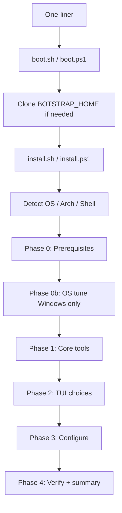

# Botstrap architecture

Botstrap is a cross-platform bootstrap that turns a fresh Mac, Linux, or Windows machine into a configured developer environment with an AI-agent-friendly layout. This document describes **how the system is structured** and **how components interact**. For a plain-language walkthrough, see [Introduction](./INTRODUCTION.md).

## Goals

- **One command** on each platform that runs the same **logical** flow (implementation details differ; native Windows is partial—see [Cross-platform notes](./CROSS_PLATFORM.md)).
- **Registry-driven** tool definitions (YAML) instead of hardcoded install lists in orchestration code.
- **Phased install**: prerequisites, non-interactive core, interactive TUI (where supported), configuration, verification.
- **AI-first defaults**: predictable PATH, non-interactive core installs, structured agent scaffolding under `configs/agent/`.

## Entry points and boot sequence

| Platform | One-liner |
|----------|-----------|
| macOS / Linux | `curl -fsSL https://botstrap.dev/install \| bash` |
| Windows | `irm https://botstrap.dev/install.ps1 \| iex` |

The site may serve scripts by URL or `User-Agent`; explicit `.sh` / `.ps1` URLs are also valid.

**Boot scripts** (`boot.sh`, `boot.ps1`) do **not** run install phases themselves. They:

1. Require **Git** (exit with instructions if missing).
2. Clone **`BOTSTRAP_REPO`** into **`BOTSTRAP_HOME`** when that path is not already a Git checkout. Defaults: repo `https://github.com/botstrap/botstrap.git`, home `~/.botstrap` (Unix) or `%USERPROFILE%\.botstrap` (Windows).
3. **Exec** `install.sh` (Unix) or `install.ps1` (Windows) from that checkout.

**Orchestrators** (`install.sh`, `install.ps1`) load **`lib/detect`** (or equivalent), then run phases in order.

## Repository layout

```
botstrap/
  boot.sh / boot.ps1          # curl / irm entry (clone + handoff)
  install.sh / install.ps1    # Orchestrators
  bin/botstrap                # Thin CLI (update / reconfigure / doctor / version)
  lib/                        # Shared primitives (detect, log, pkg)
  install/                    # Phases and per-tool modules
  configs/                    # Templates for shell, git, editor, agent; OS tuning YAML
  themes/                     # Theme bundles (terminal, prompt, editor)
  registry/                   # core.yaml, optional.yaml
  docs/                       # User and contributor documentation
  version                     # Semver string for reporting and `botstrap version`
```

See [Registry specification](./REGISTRY_SPEC.md) for the YAML schema and [Cross-platform notes](./CROSS_PLATFORM.md) for package-manager mapping.

## Installation phases



| Phase | Script | Purpose |
|-------|--------|---------|
| 0 | `install/phase-0-prerequisites.sh` / `.ps1` | **git**, **curl**, **jq**, **yq**, **gum** (and equivalents) so registry parsing, TUI, and installs can run. **yq** is required for Phase 1 and Phase 4 on Unix. |
| 0b | `install/phase-0b-os-tune.ps1` | **Windows only:** developer-oriented OS settings from `configs/os/windows.yaml` via `install/modules/os-tune-windows.ps1`. |
| 1 | `install/phase-1-core.sh` / `.ps1` | Non-interactive install of every tool in `registry/core.yaml` via `lib/pkg` + registry (per-tool `install/modules/*` when needed). |
| 2 | `install/phase-2-tui.sh` / `.ps1` | Interactive **gum** flows on macOS/Linux when gum is available; otherwise safe defaults and no prompts. Native Windows: limited; full parity recommended via **WSL** + `install.sh`. |
| 3 | `install/phase-3-configure.sh` / `.ps1` | Dotfiles and templates from `configs/`; installs **optional** registry selections. See [Configuration](./CONFIGURATION.md). |
| 4 | `install/phase-4-verify.sh` / `.ps1` | Run `verify` commands for core tools; print summary. |

Optional per-tool scripts under `install/modules/` hold logic that is too complex for inline YAML (extra guards, post-steps). Simple tools can be YAML-only.

## Registry-driven package layer

`lib/pkg.sh` (and `lib/pkg.ps1` on Windows) provide:

- **`botstrap_pkg_install`** — resolve a tool in `registry/core.yaml`, pick the install snippet for the current OS/distro, and execute it.
- **`botstrap_pkg_verify`** — run the tool’s `verify` command from the registry.
- Optional-group helpers used by Phase 3 to install selected **`registry/optional.yaml`** items.

Orchestrators treat the registry as the source of truth; modules supplement where needed.

## TUI (Phase 2)

On **macOS/Linux**, when **gum** is available, the TUI uses [Charmbracelet Gum](https://github.com/charmbracelet/gum). Typical steps:

1. Welcome banner.
2. Git identity (`gum input`).
3. Editor (single select).
4. Programming languages (multi select).
5. Databases (multi select; Docker-first in registry).
6. AI agent CLIs (multi select).
7. Theme (single select).
8. Optional apps (multi select).
9. Confirm summary (`gum confirm`).

Selections are exported as **`BOTSTRAP_*`** environment variables for **Phase 3** (optional installs from `registry/optional.yaml` and file copies from `configs/`). Exact names are documented in [Reference](./REFERENCE.md) and in the header of `install/phase-2-tui.sh`.

## `bin/botstrap` CLI

The checkout-local CLI implements:

| Command | Behavior |
|---------|----------|
| `botstrap version` | Print semver from the `version` file. |
| `botstrap update` | **`git pull --ff-only`** in the repository root. Does **not** automatically re-run install phases. |
| `botstrap reconfigure` | Re-run Phase 2 and Phase 3 only (same repo root as `bin/`). |
| `botstrap doctor` | Run Phase 4 verification (`install/phase-4-verify.sh`) for core tools. |

There is **no** `uninstall` subcommand in the current implementation.

## Security and trust

- Pipe-to-shell installs are inherently trust-based; users should read `boot.sh` / `boot.ps1` and this repo before running.
- Registry install fields are executed as shell on Unix; keep entries auditable and avoid fetching unaudited third-party scripts where a package manager suffices.

## Related documents

- [Introduction](./INTRODUCTION.md) — What Botstrap does, end to end.
- [Getting started](./GETTING_STARTED.md) — One-liners, local dev, non-interactive behavior.
- [Reference](./REFERENCE.md) — CLI, env vars, artifacts.
- [Configuration](./CONFIGURATION.md) — `configs/` → destination paths.
- [Registry specification](./REGISTRY_SPEC.md) — YAML schema.
- [Tool selection](./TOOL_SELECTION.md) — Why each core and optional tool is included.
- [Cross-platform notes](./CROSS_PLATFORM.md) — OS and package-manager strategy.
- [AI agent friendliness](./AI_AGENT_FRIENDLINESS.md) — Agent-oriented design choices.
- [Contributing](./CONTRIBUTING.md) — How to contribute.
