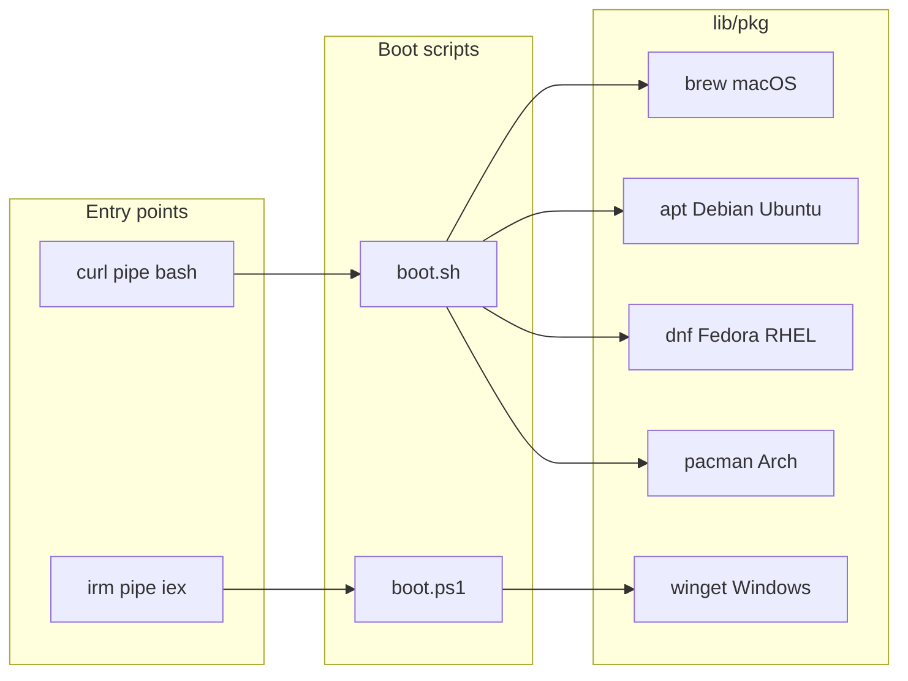

# Cross-platform strategy

Botstrap targets **macOS**, **Linux** (multiple families), and **Windows**. The same phases run everywhere; only detection, package commands, and paths differ.

**Windows vs WSL:** Native **`install.ps1`** is **partial** compared to macOS/Linux (Phase 2 TUI and some paths differ). The orchestrator prints a reminder to prefer **WSL** and **`install.sh`** for parity. Treat Windows-native installs as best-effort unless you have validated them for your workflow.

## Entry points

| Platform | Mechanism | Script |
|----------|-----------|--------|
| macOS / Linux | `curl … \| bash` | `boot.sh` → `install.sh` |
| Windows | `irm … \| iex` | `boot.ps1` → `install.ps1` |

`lib/detect.sh` and `lib/detect.ps1` export OS, architecture, and package-manager hints for the registry resolver.

## Package managers

| OS family | Primary | Notes |
|-----------|-----------|------|
| **macOS** | Homebrew | Install Homebrew if missing; most core tools use `brew`. |
| **Debian / Ubuntu** | `apt` | Prefer `apt` for system packages; Linuxbrew optional for gaps. |
| **Fedora / RHEL** | `dnf` | Same gap-fill pattern as Debian. |
| **Arch** | `pacman` | AUR installers stay out of core unless upstream documents a safe one-liner. |
| **Windows** | `winget` | Primary; **Scoop** documented as fallback for packages missing from winget. |

## Registry key selection

Install snippets in YAML use keys such as `darwin`, `linux-apt`, `linux-dnf`, `linux-pacman`, `linux`, `windows`, and `all`. The package layer maps detected OS and distro to the correct key (see `docs/REGISTRY_SPEC.md`).

## Paths and configuration

| Concept | Unix | Windows |
|---------|------|---------|
| Install root | `$HOME/.botstrap` | `%USERPROFILE%\.botstrap` |
| Shell config | `~/.bashrc`, `~/.zshrc` | PowerShell `$PROFILE` |
| XDG config | `~/.config/...` | `%LOCALAPPDATA%` / documented equivalents |

Phase 3 copies or merges templates from `configs/` according to selections; Windows-specific branches live in `install.ps1` and `lib/pkg.ps1`.

## OS developer tuning (Windows)

After Phase 0, native Windows installs run **Phase 0b** (`install/phase-0b-os-tune.ps1`), which applies idempotent “office PC → dev box” fixes from `configs/os/windows.yaml` via `lib/os-tune-windows.ps1`. The install does **not** stop if a step is blocked by policy or missing admin rights; each item reports `applied`, `already_ok`, `needs_admin`, `manual_required`, or `skipped`.

| Item | Purpose | Automation |
|------|---------|------------|
| **Developer Mode** | Developer features (see Microsoft’s [Enable your device for development](https://learn.microsoft.com/en-us/windows/apps/get-started/enable-your-device-for-development)); commonly needed so symlink-based tooling behaves on the desktop. | Sets `HKLM\SOFTWARE\Microsoft\Windows\CurrentVersion\AppModelUnlock` when **elevated**; otherwise warns with `ms-settings:developers`. |
| **Long paths** | Reduces `MAX_PATH` pain for deep trees (`node_modules`, clones). | Sets `HKLM\SYSTEM\CurrentControlSet\Control\FileSystem\LongPathsEnabled=1` when elevated ([Maximum path length limitation](https://learn.microsoft.com/en-us/windows/win32/fileio/maximum-file-path-limitation)); reboot may be required. Also sets `git config --global core.longpaths true` (user scope). |
| **App execution aliases** | Store stubs for `python` / `python3` in `WindowsApps` hijack PATH. | **Detection + manual step:** open **Settings → Apps → Advanced app settings → App execution aliases** and turn off aliases, or run `Start-Process 'ms-settings:apps-feature'`. |
| **PowerShell execution policy** | Allows running local scripts (e.g. `RemoteSigned` for `CurrentUser`). | `Set-ExecutionPolicy -Scope CurrentUser RemoteSigned` when stricter than needed. |
| **UTF-8 system locale (“Beta”)** | Fewer encoding surprises in CLIs. | **Default off** in YAML; **no silent registry rewrite.** Set `BOTSTRAP_OS_TUNE_UTF8=1` to print guidance (Region / administrative language settings; reboot likely). |

**Environment variables**

| Variable | Effect |
|----------|--------|
| `BOTSTRAP_OS_TUNE=0` | Skip all OS tuning. |
| `BOTSTRAP_OS_TUNE_SKIP` | Comma-separated IDs from `windows.yaml` (e.g. `developer_mode,utf8_system_locale`). |
| `BOTSTRAP_OS_TUNE_UTF8=1` | Opt in to UTF-8 guidance (still respects `SKIP`). |

Phase 4 on Windows prints an **OS tuning doctor** summary (Developer Mode, long paths, execution policy, Git `core.longpaths`, Python shim, UTF-8 heuristic).

## Line endings and execution

- Shell scripts in the repo use LF; Git `core.autocrlf` on Windows should not break `boot.sh` when run under WSL or Git Bash.
- Native Windows execution uses `boot.ps1` / `install.ps1` with `RemoteSigned` or stricter policies in mind; document execution policy in `docs/CONTRIBUTING.md` if we add signed releases.

## Testing matrix (aspirational)

Contributors should validate changes on at least one Linux distro plus either macOS or Windows where possible. CI may use containers for Linux-only checks.

## Gaps and fallbacks

- If a tool has no winget id, optional Scoop syntax can be added under `windows-scoop` when the pkg layer supports it.
- If a generic `linux` installer exists (e.g. official `curl | sh`), prefer it only when documented by the vendor and non-interactive.
