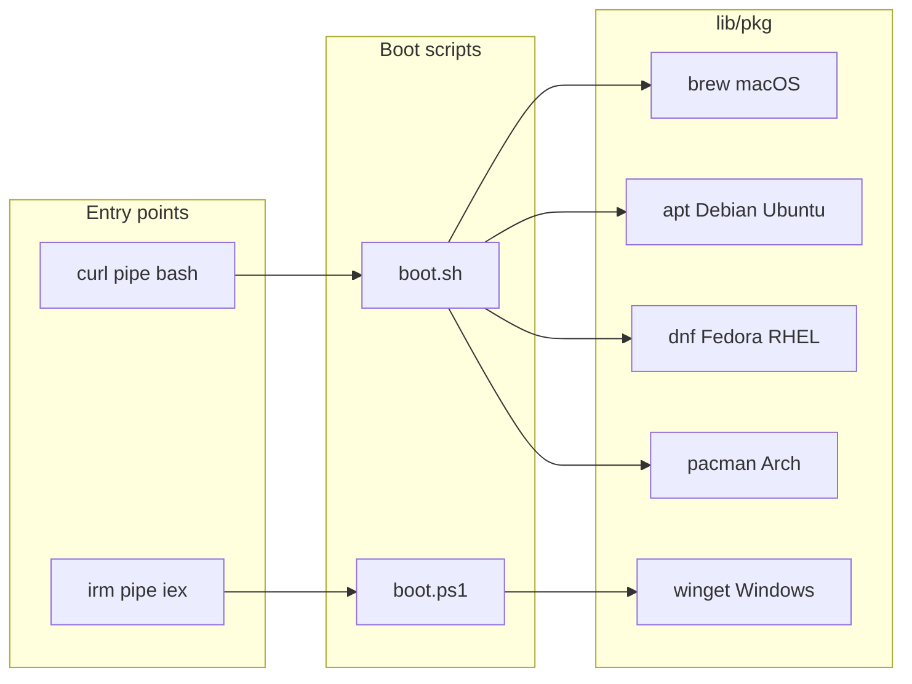

# Cross-platform strategy

Botstrap targets **macOS**, **Linux** (multiple families), and **Windows**. The same phases run everywhere; only detection, package commands, and paths differ.

## Entry points

| Platform | Mechanism | Script |
|----------|-----------|--------|
| macOS / Linux | `curl … \| bash` | `boot.sh` → `install.sh` |
| Windows | `irm … \| iex` | `boot.ps1` → `install.ps1` |

`lib/detect.sh` and `lib/detect.ps1` export OS, architecture, and package-manager hints for the registry resolver.

## Package managers

| OS family | Primary | Notes |
|-----------|-----------|------|
| **macOS** | Homebrew | Install Homebrew if missing; most core tools use `brew`. |
| **Debian / Ubuntu** | `apt` | Prefer `apt` for system packages; Linuxbrew optional for gaps. |
| **Fedora / RHEL** | `dnf` | Same gap-fill pattern as Debian. |
| **Arch** | `pacman` | AUR installers stay out of core unless upstream documents a safe one-liner. |
| **Windows** | `winget` | Primary; **Scoop** documented as fallback for packages missing from winget. |

## Registry key selection

Install snippets in YAML use keys such as `darwin`, `linux-apt`, `linux-dnf`, `linux-pacman`, `linux`, `windows`, and `all`. The package layer maps detected OS and distro to the correct key (see `docs/REGISTRY_SPEC.md`).

## Paths and configuration

| Concept | Unix | Windows |
|---------|------|---------|
| Install root | `$HOME/.botstrap` | `%USERPROFILE%\.botstrap` |
| Shell config | `~/.bashrc`, `~/.zshrc` | PowerShell `$PROFILE` |
| XDG config | `~/.config/...` | `%LOCALAPPDATA%` / documented equivalents |

Phase 3 copies or merges templates from `configs/` according to selections; Windows-specific branches live in `install.ps1` and `lib/pkg.ps1`.

## Line endings and execution

- Shell scripts in the repo use LF; Git `core.autocrlf` on Windows should not break `boot.sh` when run under WSL or Git Bash.
- Native Windows execution uses `boot.ps1` / `install.ps1` with `RemoteSigned` or stricter policies in mind; document execution policy in `docs/CONTRIBUTING.md` if we add signed releases.

## Testing matrix (aspirational)

Contributors should validate changes on at least one Linux distro plus either macOS or Windows where possible. CI may use containers for Linux-only checks.

## Gaps and fallbacks

- If a tool has no winget id, optional Scoop syntax can be added under `windows-scoop` when the pkg layer supports it.
- If a generic `linux` installer exists (e.g. official `curl | sh`), prefer it only when documented by the vendor and non-interactive.
